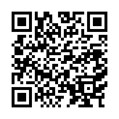
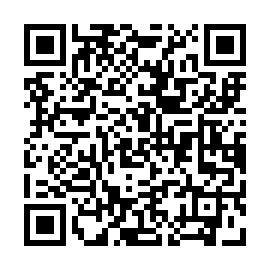

### Introduction
- 👋 Hi, I’m @chramostatm (aka. Mr. C#)
- Organizations
  - - [Fellowship of the Ping](https://fotp.it.com)
    - [RokRam IT](https://rokram.org)
    - [Mr C# Instructing](https://github.com/Mr-CSharp-Instructor-Stuff)
- 👀 I’m interested in: Human Centric Developement, Mathematics, and open-source Systems!
- 🌱 I’m currently learning: Secure Web Dev
- 💞️ I’m willing to collaborate on: Anything and everything!
  - ☕️ GitHub not your [cuppa tea](https://www.youtube.com/watch?v=rt1nlqJP2Ls)? Just let me know.
### Contact Me

### QR Codes

### 📃 Lists

- [Stars ⭐](https://github.com/chramostatm?tab=stars)
- [Helpful Links 🔗](./HelpfulLinks.md)

- [Books 📚](./RecommendedBooks.md)
- [Content Creators📺](./RecommendedContentCreators.md)

### [License](https://github.com/chramostatm/chramostatm/tree/main?tab=License-1-ov-file)

  <!-- -  -->

<!---
chramostatm/chramostatm is a ✨ special ✨ repository because its `README.md` (this file) appears on your GitHub profile.
You can click the Preview link to take a look at your changes.
--->
